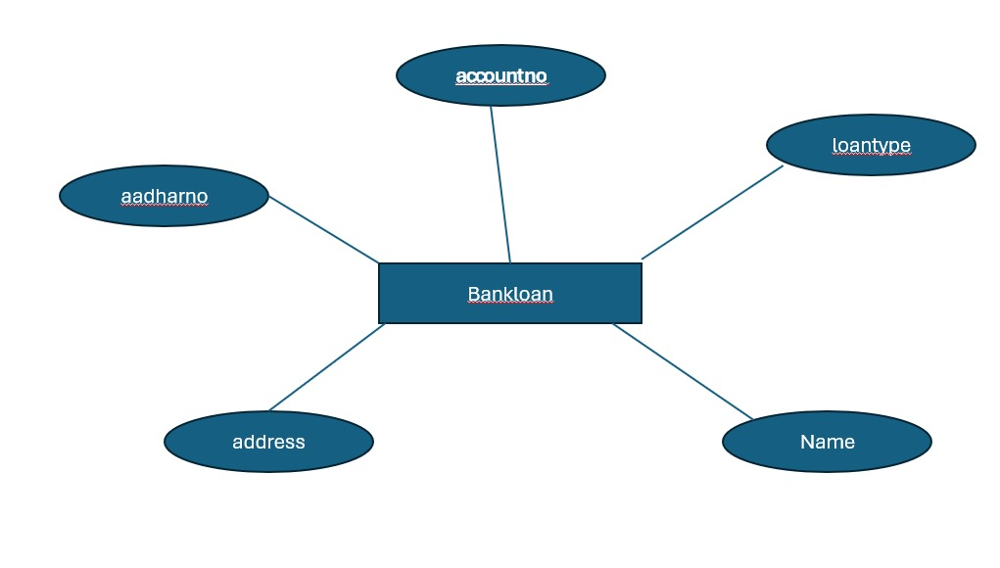
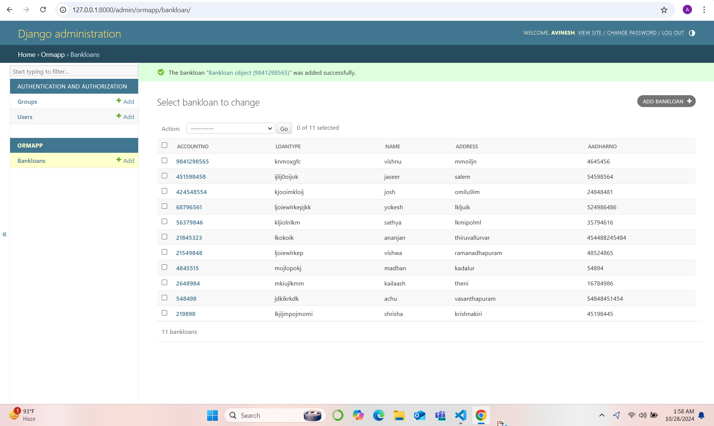

# Ex02 Django ORM Web Application
## Date: 28.10.2024

## AIM
To develop a Django application to store and retrieve data from a bank loan database using Object Relational Mapping(ORM).

## ENTITY RELATIONSHIP DIAGRAM



## DESIGN STEPS

### STEP 1:
Clone the problem from GitHub

### STEP 2:
Create a new app in Django project

### STEP 3:
Enter the code for admin.py and models.py

### STEP 4:
Execute Django admin and create details for 10 books

## PROGRAM
```
from django.db import models
from django.contrib import admin
class Bankloan(models.Model):
   accountno=models.IntegerField(primary_key="accountno")
   loantype=models.CharField(max_length=100)
   Name=models.CharField(max_length=20)
   address=models.CharField(max_length=60)
   aadharno=models.IntegerField()


class BankloanAdmin(admin.ModelAdmin):
   list_display=("accountno","loantype","Name","address","aadharno")

admin.py
from django.contrib import admin
from .models import Bankloan,BankloanAdmin
admin.site.register(Bankloan,BankloanAdmin)
```


## OUTPUT



## RESULT
Thus the program for creating a database using ORM hass been executed successfully
